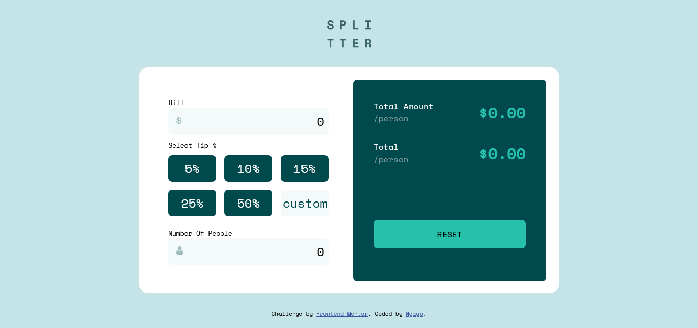

# Frontend Mentor - Tip calculator app solution

This is a solution to the [Tip calculator app challenge on Frontend Mentor](https://www.frontendmentor.io/challenges/tip-calculator-app-ugJNGbJUX). Frontend Mentor challenges help you improve your coding skills by building realistic projects

## Table of contents

- [Overview](#overview)
  - [The challenge](#the-challenge)
  - [Screenshot](#screenshot)
  - [Links](#links)
- [My process](#my-process)
  - [Built with](#built-with)
  - [What I learned](#what-i-learned)
  - [Continued development](#continued-development)
  - [Useful resources](#useful-resources)

### The challenge

Users should be able to:

- View the optimal layout for the app depending on their device's screen size
- See hover states for all interactive elements on the page
- Calculate the correct tip and total cost of the bill per person

### Screenshot

### Links

- Solution URL: [Add solution URL here](https://your-solution-url.com)
- Live Site URL: [Add live site URL here](https://your-live-site-url.com)

## My process

### Built with

- Semantic HTML5 markup
- CSS custom properties
- Flexbox
- CSS Grid
- Mobile-first workflow
  -Vanilla Javascript

### What I learned

I had to revisit Javascript once again, This has actually been one of my first Javascript project without a tutor.
I checked out how to interact with the DOM and some other concepts.

### Continued development

I have to keep on practicing more on vanilla Javascript because I am still not comfortable with it. I also need to work more on CSS before jumping into any framework.

### Useful resources

- [w3 schools] - This helped me get reference materials for several concepts I did not understand well.
- [MDN docs] - I would rush here to find deeper explanation to what was not clear in other documentations. I also read several blogs on medium just to get me started with Javascript.

## Author

- Website - [Ngayo Ben]
- Twitter - [Ngayo](https://www.twitter.com/ben_ngayo)
